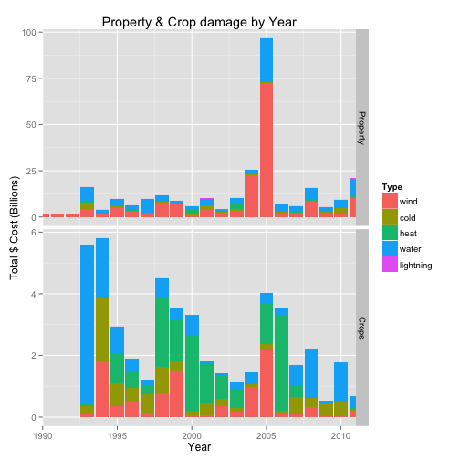

---
title: Introducing Storm Explorer
author: Andy Phillips
mode  : selfcontained
framework: impressjs
widgets: [shiny]
github:
  user: ramnathv
  repo: slidify
twitter:
  text: "Presentation for Coursera Data Products Project"
url:
  lib: libraries
--- .slide x:-1000 y:-1500

<q>Storms and other **severe** events can result in fatalities, injuries, and property damage.</q>

--- .slide x:0 y:-1500

<q> Using **R** and **Shinyapps.io** this NOAA database can now be queried interactively with the event data visually represented on a map of where it took place.</q>

--- .slide x:1000 y:-1500

<q>
 
</q>

--- #title x:0 y:0 scale:4

Introducing
# Storm Explorer

--- #its x:850 y:3000 rot:45 scale:5

 It's a **visual presentation**  
of the NOAA storm tracking database from [NWS](http://www.weather.gov/)  
and based on the **leaflet shiny package** by Joe Chen.

--- #big x:3500 y:2100 rot:180 scale:6

see the affects of <b>major</b> storms

--- #tiny x:2825 y:2325 z:-3000 rot:300 scale:1

and **lightning** strikes

--- #ing x:3500 y:-850 rot:270 scale:6
 <b class="positioning">snow</b>, <b class="rotating">tornadoes</b> and <b class="scaling">precipitation</b> of all kinds.

  
